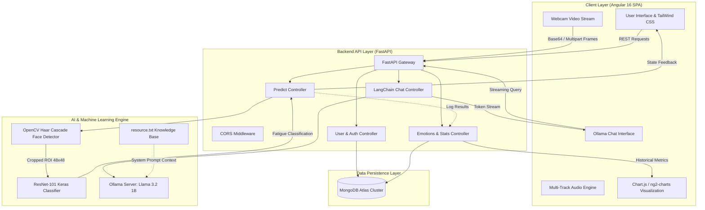

<div align="center">


# Focus With Me

**An AI-Powered Deep Work Companion with Real-Time Attention Tracking and Ambient Productivity Spaces**

[](https://angular.io/)
[](https://fastapi.tiangolo.com/)
[](https://www.tensorflow.org/)
[](https://opencv.org/)
[](https://ollama.ai/)
[](https://www.mongodb.com/)
[](https://tailwindcss.com/)
[](https://www.typescriptlang.org/)
[](https://www.python.org/)

<p align="center">
  <a href="#project-overview">Project Overview</a> &bull;
  <a href="#video-demonstration">Video Demonstration</a> &bull;
  <a href="#application-preview">Application Preview</a> &bull;
  <a href="#core-features">Core Features</a> &bull;
  <a href="#system-architecture">System Architecture</a> &bull;
  <a href="#tech-stack">Tech Stack</a> &bull;
  <a href="#installation-and-setup">Installation</a> &bull;
  <a href="#project-structure">Project Structure</a> &bull;
  <a href="#team-and-authors">Authors</a>
</p>

</div>

---

## Project Overview

In digital work and distance learning, sustained attention is constantly undermined by cognitive fatigue, notification overload, and isolated study habits. Traditional productivity tools rely on manual timers or intrusive task checklists, failing to provide meaningful insight into actual mental engagement.

**Focus With Me** is a comprehensive full-stack application designed to cultivate deep work through non-intrusive computer vision and real-time behavioral feedback. The system combines:

1. **Computer Vision Fatigue Detection**: Continuous facial state analysis using a fine-tuned deep neural network (ResNet-101) to distinguish focused states from progressive cognitive fatigue.
2. **Immersive Audio-Visual Workspaces**: Fully customizable ambient environments integrating curated video backgrounds, customizable multi-track soundscapes, and session timers.
3. **Conversational AI Productivity Coach**: A locally hosted Large Language Model (Llama 3.2 via Ollama and LangChain) providing context-aware guidance and focus strategies.
4. **Longitudinal Attention Analytics**: Interactive dashboards displaying concentration curves, session performance distributions, and peer accountability leaderboards.

---

## Video Demonstration

Watch the complete demonstration of Focus With Me in action, showcasing real-time attention tracking, ambient environment customization, and analytics:

<div align="center">
  <a href="https://www.youtube.com/watch?v=fUE1tAz2DtE" target="_blank" rel="noopener noreferrer">
    
  </a>
  <p>
    <a href="https://www.youtube.com/watch?v=fUE1tAz2DtE" target="_blank" rel="noopener noreferrer">
      <b>Watch on YouTube: Full Platform Walkthrough and Feature Demo</b>
    </a>
  </p>
</div>

---

## Application Preview

### Solo Study Environment

The primary workspace brings together an aesthetic anime/scenic background selector, multi-layer ambient sound mixer, Pomodoro countdown timer, interactive task checklist, and instant AI coaching.

<div align="center">
  
  <p><i>Solo Study Workspace: Active session timer, task checklist, dynamic video themes, and ambient audio controls.</i></p>
</div>

---

### Concentration Analytics and Performance Dashboard

The performance center tracks user focus over time, illustrating exact attention variations, study volume averages, and ranking metrics.

<div align="center">
  
  <p><i>Analytics Dashboard: Real-time concentration curve, attention distribution donut chart, session metrics, and community leaderboard.</i></p>
</div>

---

### Collaborative Coworking Hub

Focus With Me fosters collective commitment through dedicated community integration, enabling students and professionals to study alongside peers.

<div align="center">
  
  <p><i>Coworking Hub: Community connectivity for mutual webcam accountability and structured focus sessions.</i></p>
</div>

---

## Core Features

### 1. Real-Time Attention and Fatigue Analysis
* **Automated Face Localization**: Employs Haar Cascade classifiers via OpenCV to isolate facial regions with adaptive bounding and zoom adjustments.
* **Deep Neural Classification**: A custom-trained ResNet-101 convolutional neural network analyzes facial micro-features and predicts three attention states:
  * `Neutre` (Alert and concentrated)
  * `Fatigue1` (Initial attention drop, early fatigue)
  * `Fatigue2` (Severe fatigue, distraction, or eye strain)
* **Non-Intrusive Capture**: Frames are processed asynchronously via HTTP endpoints without interrupting the study session.

### 2. Immersive Solo Study Suite
* **Dynamic Video Backgrounds**: High-definition video canvases classified by aesthetic genres: Technology, Anime, Desk, Nature, and Animals.
* **Multi-Channel Soundscape Mixer**: Independent volume controls and playback toggles for five curated ambient audio tracks:
  * LoFi Beats
  * Library Ambience
  * Nature Sounds
  * Fireplace Crackle
  * Rain Sounds
* **Integrated Session Management**: Configurable countdown timer with start/pause/reset controls paired with quick-add session goals.

### 3. Intelligent AI Productivity Assistant
* **Local LLM Engine**: Powered by Meta's Llama 3.2 (1B Instruct) executing locally through Ollama, guaranteeing privacy and zero external API latency.
* **LangChain Orchestration**: Implements session-based conversational memory (`InMemoryChatMessageHistory`) and streaming generation (`StreamingResponse`).
* **Evidence-Based Productivity Knowledge Base**: Grounded on a dedicated repository of deep work literature, timeboxing principles, the 2-minute rule, and habit-formation strategies.

### 4. Comprehensive Performance Analytics
* **Continuous Concentration Curves**: Interactive temporal charts built with Chart.js and ng2-charts displaying attention percentages across session intervals.
* **Attention Distribution Breakdown**: Proportional donut visualization classifying concentrated vs. non-concentrated time intervals.
* **Personal Progress and Leaderboard**: Aggregate statistics including daily average hours, total study duration, user rank, and peer leaderboard standings.

---

## System Architecture


```mermaid
graph TD
    subgraph Client ["Client Layer (Angular 16 SPA)"]
        UI[User Interface & TailWind CSS]
        Webcam[Webcam Video Stream]
        Audio[Multi-Track Audio Engine]
        Charts[Chart.js / ng2-charts Visualization]
        ChatUI[Ollama Chat Interface]
    end

    subgraph Server ["Backend API Layer (FastAPI)"]
        API[FastAPI Gateway]
        CORS[CORS Middleware]
        UserCtrl[User & Auth Controller]
        EmotionCtrl[Emotions & Stats Controller]
        ChatCtrl[LangChain Chat Controller]
        VisionCtrl[Predict Controller]
    end

    subgraph AI_Engine ["AI & Machine Learning Engine"]
        CV[OpenCV Haar Cascade Face Detector]
        ResNet[ResNet-101 Keras Classifier]
        Ollama[Ollama Server: Llama 3.2 1B]
        KB[resource.txt Knowledge Base]
    end

    subgraph Storage ["Data Persistence Layer"]
        Mongo[(MongoDB Atlas Cluster)]
    end

    Webcam -->|Base64 / Multipart Frames| API
    UI -->|REST Requests| API
    ChatUI -->|Streaming Query| API

    API --> VisionCtrl
    API --> ChatCtrl
    API --> UserCtrl
    API --> EmotionCtrl

    VisionCtrl --> CV
    CV -->|Cropped ROI 48x48| ResNet
    ResNet -->|Fatigue Classification| VisionCtrl

    ChatCtrl --> Ollama
    KB -.->|System Prompt Context| Ollama

    UserCtrl --> Mongo
    EmotionCtrl --> Mongo
    VisionCtrl -.->|Log Results| EmotionCtrl

    EmotionCtrl -->|Historical Metrics| Charts
    VisionCtrl -->|State Feedback| UI
    ChatCtrl -->|Token Stream| ChatUI
```

---

## Tech Stack

| Domain | Technology | Description |
| :--- | :--- | :--- |
| **Frontend Framework** | Angular 16 | Modular component-based client application architecture |
| **Styling & Design** | Tailwind CSS 3.4 & PrimeNG 16 | Modern aesthetic, dark mode support, and responsive layouts |
| **Data Visualization** | Chart.js 3.9 & ng2-charts 4.0 | High-performance interactive concentration charts |
| **Icons & Media** | FontAwesome 6 & PrimeIcons | Cohesive vector iconography across modules |
| **Backend API** | FastAPI (Python 3.10+) | High-throughput asynchronous REST API and streaming endpoints |
| **Server Engine** | Uvicorn (ASGI) | Lightning-fast asynchronous server implementation |
| **Deep Learning** | TensorFlow / Keras (ResNet-101) | Custom-trained 101-layer residual network for fatigue classification |
| **Computer Vision** | OpenCV (cv2) | Haar Cascade frontal face detection and image preprocessing |
| **Local LLM & Chat** | Ollama & Meta Llama 3.2 (1B) | Local, private conversational AI with low memory footprint |
| **AI Framework** | LangChain Core & LangChain Ollama | Memory chaining, prompt templating, and response streaming |
| **Database** | MongoDB Atlas (Motor / PyMongo) | Asynchronous NoSQL document store for users, goals, and metrics |
| **Authentication** | PyJWT & Passlib (Bcrypt) | Secure password hashing and JSON Web Token authorization |

---

## Installation and Setup

### Prerequisites

Verify that the following tools are installed on your workstation:
* **Node.js**: Version 18.x or 20.x
* **npm**: Version 9.x or higher
* **Angular CLI**: Version 16.x (`npm install -g @angular/cli@16`)
* **Python**: Version 3.10 or 3.11
* **Git** and **Git LFS**
* **Ollama**: Installed from [ollama.com](https://ollama.com/)

---

### Step 1: Clone the Repository

```bash
git clone https://github.com/MohamedAliChakrounX/Focus_With_Me.git
cd Focus_With_Me
```

---

### Step 2: Configure Ollama (Local AI Assistant)

1. Launch the Ollama service on your local machine:
   ```bash
   ollama serve
   ```

2. Pull the required lightweight instruct model:
   ```bash
   ollama pull llama3.2:1b-instruct-fp16
   ```

---

### Step 3: Backend Setup and Launch

1. Navigate to the backend directory:
   ```bash
   cd Backend
   ```

2. Create and activate a Python virtual environment:
   ```bash
   # On Linux/macOS
   python3 -m venv venv
   source venv/bin/activate

   # On Windows (PowerShell)
   python -m venv venv
   .\venv\Scripts\Activate.ps1
   ```

3. Install required Python packages:
   ```bash
   pip install fastapi uvicorn[standard] pydantic python-multipart numpy opencv-python tensorflow langchain langchain-core langchain-ollama motor pymongo passlib pyjwt
   ```

4. Verify database and security configuration in `config.py`:
   ```python
   MONGO_URI = "mongodb+srv://<username>:<password>@cluster0.mongodb.net/"
   MONGO_DB = "test"
   SECRET_KEY = "your_secret_key"
   ```

5. Launch the backend API server:
   ```bash
   uvicorn main:app --reload --host 127.0.0.1 --port 8000
   ```
   The interactive API documentation (Swagger UI) is available at: `http://127.0.0.1:8000/docs`

---

### Step 4: Frontend Setup and Launch

1. Open a new terminal window and navigate to the frontend directory:
   ```bash
   cd Frontend
   ```

2. Install the frontend dependencies:
   ```bash
   npm install
   ```

3. Start the Angular development server:
   ```bash
   npm start
   # or
   ng serve --open
   ```

4. Access the web application in your browser:
   ```
   http://localhost:4200
   ```

---

## Project Structure

```
Focus_With_Me/
├── Backend/
│   ├── controllers/
│   │   ├── background_controller.py      # Video background management
│   │   ├── but_controller.py             # User goals (buts) CRUD
│   │   ├── categorie_controller.py       # Background categories
│   │   ├── country_controller.py         # Country demographic data
│   │   ├── emotions_controllers.py       # Session attention metrics logging
│   │   ├── motivation_controller.py      # Motivational quotes service
│   │   └── user_controller.py            # User authentication and profiles
│   ├── models/
│   │   ├── best_resnet101_model.keras    # Pretrained ResNet-101 fatigue weights
│   │   ├── background.py                 # Background schema
│   │   ├── but.py                        # Goal schema
│   │   ├── categorie.py                  # Category schema
│   │   ├── Emotion.py                    # Concentration measurement schema
│   │   ├── motivation.py                 # Quote schema
│   │   └── user.py                       # User entity schema
│   ├── config.py                         # Database and JWT credentials
│   ├── fatigue_detection_config.py       # OpenCV & ResNet inference settings
│   ├── resource.txt                      # AI productivity coach knowledge base
│   ├── utils.py                          # Frame preprocessing and inference
│   └── main.py                           # FastAPI routing, CORS, and Ollama integration
│
├── Frontend/
│   ├── src/
│   │   ├── app/
│   │   │   ├── chatbot/                  # Streaming AI productivity assistant
│   │   │   ├── home/                     # Landing and platform overview
│   │   │   ├── login/ & singup/          # Authentication views
│   │   │   ├── profil/ & profileducation/# User onboarding and profile views
│   │   │   ├── shared/                   # Reusable headers, footers, navigation
│   │   │   ├── solostudy/                # Main workspace (timer, audio, video)
│   │   │   ├── study-goals/              # Goal setting and milestone tracking
│   │   │   └── study-stats/              # Chart.js concentration dashboards
│   │   ├── assets/
│   │   │   ├── images/                   # UI branding, backgrounds, logo
│   │   │   └── musics/                   # LoFi, rain, nature, fireplace audio
│   │   ├── Services/                     # Angular HTTP services
│   │   ├── styles.css                    # Tailwind CSS and PrimeNG themes
│   │   └── index.html                    # Root HTML document
│   ├── angular.json                      # Angular workspace configuration
│   ├── package.json                      # Frontend dependencies
│   └── tailwind.config.js                # Tailwind utility definitions
│
├── demo/
│   └── images/
│       ├── home.png                      # Solo study workspace screenshot
│       ├── dashboard.png                 # Analytics dashboard screenshot
│       └── espace_collaboratif.png       # Collaborative coworking screenshot
│
└── README.md                             # Project documentation
```

---

## Future Roadmap

The following architectural and functional expansions are identified for subsequent development cycles:

* **WebRTC Multi-Peer Rooms**: In-browser audio/video rooms for synchronized group study sessions without third-party redirects.
* **Wearable Sensor Integration**: Pairing with heart-rate variability (HRV) and EEG consumer devices for multi-modal cognitive fatigue validation.
* **Productivity Suite Synchronization**: Two-way synchronization with Google Calendar, Notion, and Todoist.
* **On-Device Edge Inference**: Exporting the ResNet-101 model to ONNX / TensorFlow.js for direct client-side WebGL inference.
* **Gamification and Achievements**: Focus streaks, milestone achievements, and customized avatars to boost long-term retention.

---

## Contributing

Contributions, bug reports, and suggestions are welcome. To contribute:

1. Fork the repository.
2. Create a feature branch:
   ```bash
   git checkout -b feature/NewFeature
   ```
3. Commit your changes:
   ```bash
   git commit -m "Add NewFeature"
   ```
4. Push to your branch:
   ```bash
   git push origin feature/NewFeature
   ```
5. Open a Pull Request for review.

---

## Team and Authors

This project was developed as a second-year engineering Year-End Project (**PFA - Projet de Fin d'Année**).

* **Mohamed Ali Chakroun** - Lead Developer & Machine Learning Architecture
  * GitHub: [@MohamedAliChakrounX](https://github.com/MohamedAliChakrounX)
  * LinkedIn: [Mohamed Ali Chakroun](https://www.linkedin.com/in/mohamed-ali--chakroun)
  * Email: [mohamedalichakroun.x@gmail.com](mailto:mohamedalichakroun.x@gmail.com)

**Collaborators and Project Contributors:**
* **Yessine Abdennadher**
* **Rami Frikha**
* **Wassim Triki**

---

<div align="center">
  <p><b>Focus With Me</b> &mdash; Cultivating deeper concentration through intelligent computing.</p>
</div>
